# **Expenses Calculator**
  

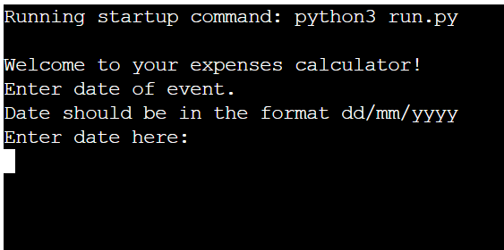  

This Expenses Calculator is a Python command line interface (CLI) application designed to record work completed at various locations, which logs details such as date, location, work type, work fee, and distance travelled. Based on the user input it will then calculate travel expenses and the total fees due for travel and work completed. It will then transfer the data to the connected Google Sheet.

View the live application here: [ExpensesCalculator](https://expenses-calculator-93f67e190108.herokuapp.com/)  

Google Sheets (view only) [here.](https://docs.google.com/spreadsheets/d/1VC_oKD_-P18TzticsIXXsxaBuKRskCvY82OEt0-8TLo/edit?usp=sharing)

## Contents
* [**User Experience/User Interface (UX/UI)**](#user-experienceuser-interface-uxui)
  * [User Goals](#user-goals)
  * [User Stories](#user-stories)
* [**Creation process**](#creation-process)
  * [Project Planning](#project-planning)
  * [Flowchart](#flowchart)
  * [Google API SetUp](#google-api-setup)
  * [Python Logic](#python-logic)
  * [Data Model - Google Sheets](#data-model---google-sheets)
  * [Design Choices](#design-choices)
* [**Features**](#features)
  * [How to Use Expenses Calculator](#how-to-use-bakestock)
  * [Future Features](#future-features)
* [**Technologies Used**](#technologies-used)
* [**Libraries & Packages**](#libraries--packages)
* [**Testing**](#testing)
* [**Creation & Deployment**](#creation--deployment)
* [**Credits**](#credits) 

  
# User Experience/User Interface (UX/UI)  
  
## User Goals
The Expenses Calculator is designed to be an easy-to-use application to help the user keep track of work completed, and to provide an efficient way of calculating expenses and total fees for work completed. 

  - It must be easy for the user to navigate.
  - Clear instructions are available to ensure the user will be prompted to enter the relevant data at the correct time.
  - There is an option to re-enter data at each step in case the user enters incorrect information.
  - Dead ends are avoided by causing each function to re-run in the event of invalid response / input.

## User Stories  
  1. As a user, I want a practical application to store information about work completed. 
  2. As a User, I want an efficient application which will accurately calculate and record my expenses.
  3. As a User, I want the application to automatically update the relevant spreadsheet.
  4. As a User, I want an application which is clear and easy to use.
  5. As a User, I want an application which provides instructions at every step regarding the type of input required.
  6. As a User, I want the option to re-enter data if I am unhappy with what I have already entered.
  
  

# Creation Process    
  
## Project Planning  
The idea for this project came from my current work as an organist. Apart from my usual places of work, my job also takes me to various locations around the country and for different events. I wanted to create an application which would help me to keep track of work completed and which would keep track of fees due for my work. This programme is therefore designed to record information about the date, location, event type, basic fee and distance travelled. Furthermore, based on information provided about distance travelled, it will calculate my travel expenses and then calculate my total expenses by adding my basic fee and travel expenses. It then records this data in a spreadsheet.
 
The Expenses Calculator was created from this idea and fully planned out using [Lucidchart](https://www.lucidchart.com/) to create a flowchart showing the logic and layout of the application. Once I had investigated the terminal that would run this application, I made sure to stay within it's restrictions and referred back to my flowchart frequently. My main goals for the application were:  

- The first main goal was to have functions with inputs which would record user data.
- The second important goal was to ensure that the application would accurately transfer the inputted data to the relevant spreadsheet.

Based on the design of the flowchart, I created the various functions in my code, testing them at each stage, particularly ensuring that the user would not meet any dead ends if they did not enter a valid response or if they wished to re-enter a piece of data.

  
I decided to use Google Sheets to store any data that was entered from the terminal. In this instance the sheet has six colums which will take the data entered through the Python application, namely: Date, Location, Event, Fee, Travel Expenses, Total Fee.

  
## Flowchart   
To help with planning my project, I used Lucidchart to produce a flowchart of my expected functions and their flow.

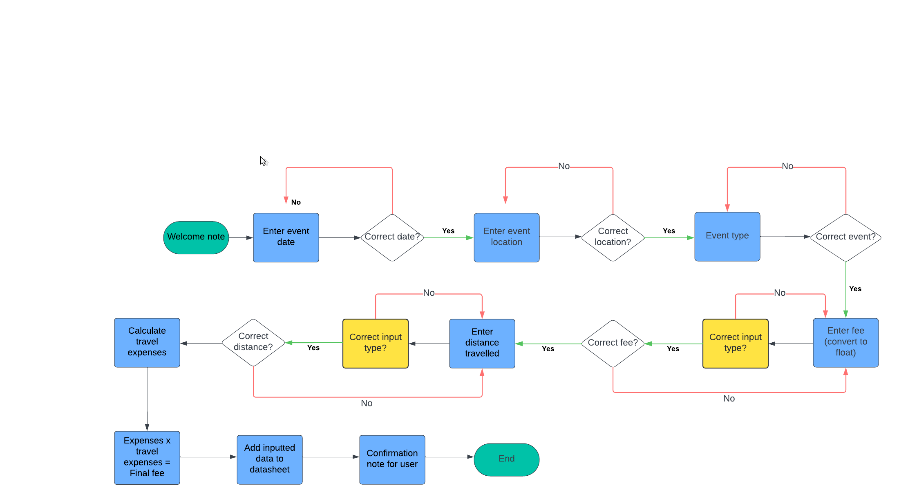  

   

## Google API SetUp   
Before beginning to code, I set up the relevant credentials and API. This process is detailed in the [Creation & Deployment](#creation--deployment) section. For security reasons regarding connecting a Google account for accessing Google Sheets, I ensured that the `CREDS.json` file would not be open to public view.

Google Sheets was used to store any entered user data and called upon when data was manipulated and updated. All data entry and manipulation takes place within the terminal. 

Clear instructions are printed in the terminal instructing the user in how to enter the data, so that it may be displayed correctly on its output, within the scope of this project. 

   

## Python Logic  
As this is my first Python project, I aimed to create a relatively simple application which is practical and relevant to me. Having completed my initial flowchart, I began the process of coding. I created simple functions corresponding to the data I wished to record and transfer to the spreadsheet.

In each function which required user input I made use of if/elif statements to ensure that the user can confirm that they are happy with the data inputted before moving on to the next step. If the user wishes to re-enter data or if they answer anything other than "y/yes" or "n/no" they will likewise be prompted to re-enter the required data.

Throughout the building of the application I tested the functions individually and together to ensure that the flow of the application was correct.

   

## Data Model - Google Sheets
The data provided by the user is inputted into a single Google Sheets worksheet. The worksheet is accessed by myself as the only Editor but I include here a View only link to show the recorded data. [Google Worksheets](https://docs.google.com/spreadsheets/d/1VC_oKD_-P18TzticsIXXsxaBuKRskCvY82OEt0-8TLo/edit?usp=sharing)  

   

   

## Design Choices      
The CLI code was provided through the use the the CI's [Python Essentials template](https://github.com/Code-Institute-Org/python-essentials-template). I did not alter the given HTML or JavaScript code. _(Refer to the [Creation & Deployment](#creation--deployment) section of this README to learn how to recreate this project.)_
  

   
      
    

# Features

## How to Use Expenses Calculator

### Launch  
Once the application is opened, the user is greeted with a welcome message.

  
  
    
### Date Input   
The user is prompted to enter the date of the work they wish to record. To ensure consistency when the data is transferred to the spreadsheet, they are reminded to enter the date in the format dd/mm/yyyy. Once the date has been inputted, a response will appear to tell the user what data they gave, followed by a y/n option to confirm and continue to the next step.

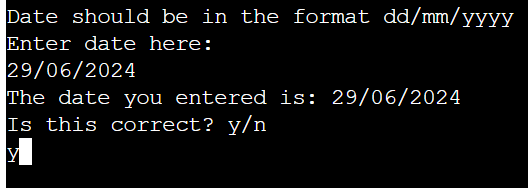
  
  
### Location 
The user is then prompted to enter their work location. The first letter will appear capitalized even if the user uses lower-case letters. As above, they are given the option to confirm or amend the data. 

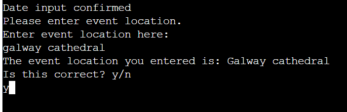  
  
    
### Event Type 
Since this programme was designed primarily for my work as an organist, the event type is recorded (e.g. funeral, wedding, choir rehearsal, recital). The first letter will appear capitalized even if the user uses lower-case letters. Once the user has inputted the data there is an opportunity to confirm or revise before moving on.

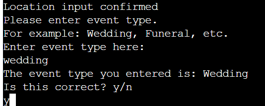
  
### Fee 
The user is prompted enter the basic fee for the event being recorded. This step specifies that the amount is to be entered in Euro(€). The input is fed back to the user with the option to confirm or re-enter the amount. The fee will be returned as a float to account for decimals in the amount.

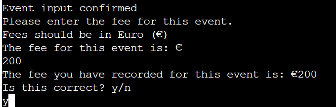

### Distance travelled and travel expenses 
The next step asks the user to input the distance travelled for work in kilometers. Once the user has confirmed the distance, the function calculates the travel expenses by multiplying the distance travelled by the amount per kilometer (in this instance €0.43 per kilometer). This amount is returned as a float.

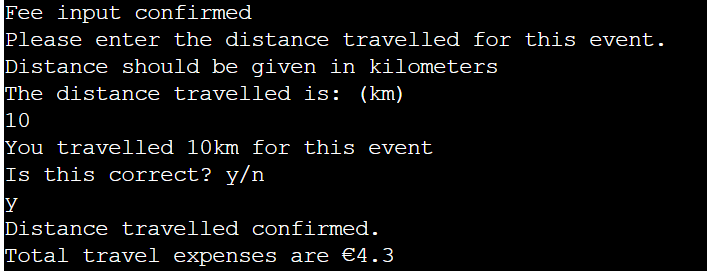

### Calculation of total fee due
The next function calculates the total fee due by adding the initial fee entered and the fee for travel expenses. Since the travel expenses may run to several decimal places, this function includes a direction to round the amount to two decimal places.

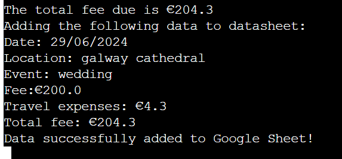
 
### Add data given to Google Sheets  
Once the total fee due has been calculated, the following results are automatically added to Google Sheets: Date, Location, Event, Initial Fee, Travel Expenses, and Total Fee. (See image above)

The user can then confirm that the requisite data entered and calculated has been transferred to the corresponding Google Sheet:

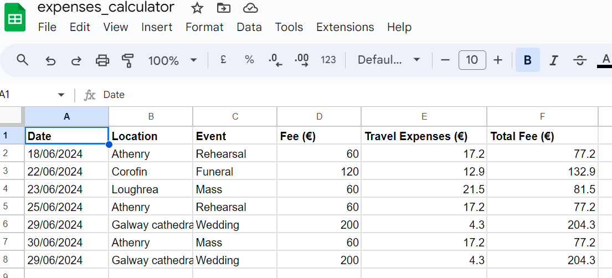

 

-----  

 

## Future Features  
There are a few features that I feel could benefit from additions in the future:
- The application could be updated to automatically input fees for certain events for which the user has a set fee, with the user only having to input the initial fee if they choose.

- The scope could also be broadened to update the Google Sheet with other statistics, such as total fees due for all events recorded to that point.

  
# Technologies Used:
   - Python - Python code written is my own except where referenced in the credits section.
   - [Lucidchart](https://www.lucidchart.com/pages/) - used to create the flowchart needed during project planning.
   - [GitHub](https://github.com/) - used for hosting the program's source code.
   - [Gitpod](https://www.gitpod.io/) - used as a workspace for developing the code and testing the program.
   - Git - used for version control.
   - [Google Sheets](https://docs.google.com/spreadsheets/) - used for storing edited and saved user data.
   - [Google Cloud Platform](https://cloud.google.com/) - used to provide the APIs for connecting the data sheets with the Python code.
   - [Heroku](https://heroku.com/apps) - used for deploying the project.
   - [PEP8 Validator](https://pep8ci.herokuapp.com/#) - used for validating the Python code.
   - [Tiny PNG](https://tinypng.com/) - used to compress images.

   

# Libraries & Packages 
   - **gspread** - gspread was imported and used to add data to the connected Google Sheets worksheet.  

   - **google.oauth.service_account** - This library was used for the authentication needed to access the Google APIs for connecting the Service Account with the Credentials function. A `CREDS.json` file was generated from this with the details needed for the API to access my Google account which holds the Google Sheets worksheet containing the applications data. When deploying to Heroku, this information is then stored in the config var section to ensure the application will run.  

  
# Testing  
At each stage of development of this application I tested how the functions worked and if they behaved as I wanted and expected.

## Validation Testing
The code was validated using the [Code Institute's](https://pep8ci.herokuapp.com/#) Pep8 Linter. No errors were found in its final testing. The results are displayed below:
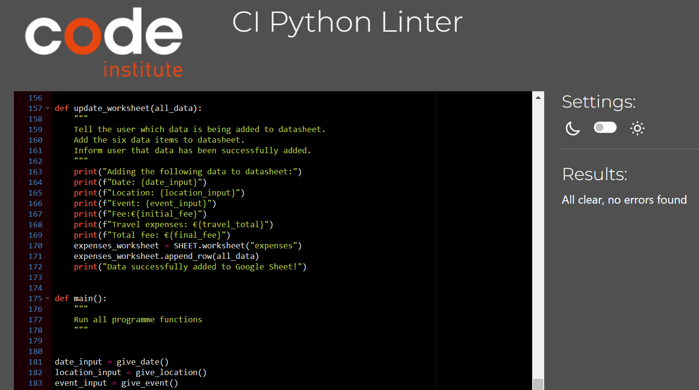

User validation was checked at each stage. Any time user input is required, the type of input is specified. Furthermore, once the input has been confirmed, the application asks for confirmation that the inputted information is correct. If the user types "y" (or "yes" / "Yes") to this prompt, the next function will begin. If the user types "n" (or "no" / "No") to the prompt, they will have the opportunity to re-enter the requested data. Should the user type something other than a  yes/no response to the prompt, they will be alerted to an invalid input and prompted to re-enter the requested data.

At each stage the user is alerted to the data which has been recorded, and a final display message confirms that the requisite data has been added to the Google Sheet.

For validation of numeric inputs (specifically those needed for calculation of total fees), I had initially hoped to use the PyInputPlus library, which gives an automatic warning if the input is not of the required type. While this worked well in the terminal, I discovered that the library is not supported by Heroku. I therefore altered my code to include try/except statements which ensure that the user can only enter digits, thereby avoiding an error later on when the application attempts to calculate fees. The image below shows how the app responds if the user fails to use the correct input type:

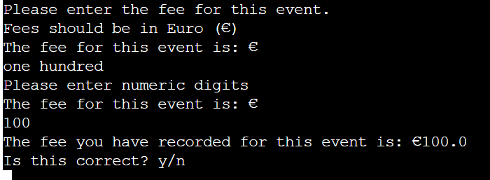

The transfer of data to the connected Google Sheet has been tested multiple times using different data, different fee values and different distances travelled. The code is designed to round to two decimal places any floats with more than two decimal places to the right, and this has been tested and verified.

## Bugs  
This is my first Python project and I discovered a number of bugs during production. Most issues were readily solved with reference to course material, the "Love Sandwiches" project, or trial and error on my part. I have documented the main bugs that required extra resources to solve:

  
|Bug                       | Where?       | Fix                       |
|--------------------------|---------------|---------------------------|
| While loop giving error when invalid input entered  | give_date function    | Add return statement to restart function |
| Function not converting string to float | give_fee function | Redefine fee_input as initial_fee with float conversion |
| Error returned for "n" or invalid input in while loop | give_travel function  | Missing parentheses in both return statements |
| PyInputPlus library incompatible with Heroku | Import library | Remove PyInputPlus and used try/except statements instead |
| Bare Except warning in Python Linter | give_fee & give_distance functions | Change "except" to "except Exception" |
  
# Creation & Deployment    
  
The below steps to creating and setting up a new Python workspace and API credentials has been guided by and adapted from the [Code Institute's](https://codeinstitute.net/ie/) Python walkthrough project 'Love Sandwiches'.

### Creating a new repository 

Steps to create a new repository.
  

The [Code Institute's Python Essential Template](https://github.com/Code-Institute-Org/python-essentials-template) was used to create a terminal for my Python file to generate it's output. To use this template, please follow these steps:
1. Log in to [GitHub](https://github.com/) or create a new account.
2. Navigate to the above Python template repository.
3. Click '**Use this template**' -> '**Create a new repository**'.
4. Choose a new repository name and click '**Create repository from template**'.
5. In your new repository space, click the green '**Gitpod**' button to generate a new workspace.   

 
  
-----  

### Activating the Google Drive & Sheets API

Steps to activate the APIs

To access the data in a Google Sheets worksheet using Python code, an API is required. Please follow these steps to set up your APIs:  

1. Navigate to the [Google Cloud Platform](https://cloud.google.com), using an email address/Google account that is registered to you alone.
2. In the Google Cloud Platform Dashboard, create a new project by clicking on the '**Select a Project**' button and choosing the '**New Project**' option. Give your new project a name and click '**Create**'. (Your access credentials are unique to each project, so create a new project for every project that you build.) 
3. Click '**Select Project**' in the blue banner to bring you to your project page.
4. Select '**APIs and Services**' from the left side menu, then select '**Library**'.
5. Use the search bar to search for the two APIs needed for this project, Google Drive API and Google Sheets API. One at time, choose the APIs from the search and click '**Enable**' on their main page. Follow the below steps for the Google Drive API, but only click '**Enable**' for the Google Sheets API. There is no need to download credentials again for it.
6. On the API overview page, click '**Create Credentials**' to generate some credentials which will allow us access to our Google Drive from our Python code.
7. Fill out the forms fields and dropdown menus with the information that is relevant to your project. For mine, I chose **Google Drive API -> Application Data -> No, I'm not using them** (regarding using Kubernetes, App Engine etc)
8. Under Service Account Details, choose a Service Account name and click '**Create**'.
9. In the Role Dropdown box choose **Basic -> Editor** then press '**Continue**'. Click '**Done**' to finish the form if you do not need to grant users access to the service account if it is a personal project.
10. On the next page, click on your new Service Account that has been created, then click on the '**Keys**' tab to '**Add Key**'. Select '**Create New Key**'.
11. Select JSON and '**Create**'. Your json file containing your API credentials will be downloaded to your machine.

-----  

### Setting up the Gitpod workspace for the APIs

Steps for workspace setup

  
1. In the new Gitpod workspace you've created with the Python Essentials template, click and drag the json file that you created in the above steps, into the Gitpod workspace.  
2. Rename it to `CREDS.json`, if you wish, and open the file. Find the client_email address you previously entered, copy it without the quotes around it.
3. In the Google Sheets file that you have created for this project, click the '**Share**' button and paste the email address into the field, choose '**Editor**', untick '**Notify People**' and click '**Share**'. This allows our project access to the spreadsheet.
4. To ensure the private credentials that you have created do not make their way to the cloud for others to view, add the `creds.json` file to your `gitignore` file before you commit any changes to your repository, and push them to the cloud.
5. Use the command `git status` to check that the `creds.json` file is not staged to be committed.

  
  
-----  

### Initial Code for connecting to our API with Python

Steps to including the Python/API connection code

1. The code needed to ensure your APIs connect correctly can be found at the top of the `run.py` file connected to this project. It is important that you remember to pass the exact same name as your spreadsheet to the `SHEET = GSPREAD_CLIENT.opn('your-filename-here')` code, or else gspread will throw an error.
2. The command `pip3 install gspread google-auth` is needed to install the gspread package for handling the worksheet data and the google-auth package to allow access to the Google Sheets account via the Credentials we downloaded earlier. Use the above command in the Gitbash terminal to install.
3. Please refer to the `run.py` file for the import, SCOPE, CREDS, SCOPED CREDS, GSPREAD CLIENT, SHEET code that is needed to connect the APIs and change any data that is personal to your project.

  
-----  

### Deploying to Heroku  

Heroku has been used to deploy this project as Python is used as a back-end language. I chose to deploy this project using Automatic Deployment in order to update the program each time I pushed new code to the GitHub repository. Here are the steps that I followed to set my project up:     

1. Log in to [Heroku](https://id.heroku.com/login).

2. Navigate to the '**New**' button in the top, right corner, and select '**Create New App**'.

3. Enter a unique app name and choose your region. Click '**Create App**'.

4. In the Deploy tab, click on the '**Settings**', reach the '**Config Vars**' section and click on '**Reveal Config Vars**'. Here you will enter KEY:VALUE pairs for the app to run successfully. In KEY enter `CREDS`, in VALUE, paste in the text content of your `CREDS.json` file. Select '**Add**'.  

5. In the Settings tab, in the Buildpack section, click '**Add Buildpack**', located near the bottom, right of the refreshed screen. One at a time, choose the '**Python**' pack, save changes, then choose the '**NodeJS**' buildpack and save changes. It is important that the Python buildpack is _above_ the NodeJs buildpack.
  
6. Go to the '**Deploy**' tab and choose GitHub as the Deployment method.

7. Search for the repository name, select the branch that you would like to build from, and connect it via the '**Connect**' button.

8. Choose from '**Automatic**' or '**Manual**' deployment options. As mentioned above, I chose the automatic option for this project. Click '**Deploy Branch**'.
10. Once the app has been built, click the '**View**' link to bring you to your newly deployed site.

  
-----  

### Forking the GitHub Repository

A copy of the original repository can be made through GitHub. Please follow the below steps to fork this repository:  

1. Navigate to GitHub and log in.  
2. Once logged in, navigate to this repository using this link [Expenses Calculator](https://github.com/niallpcarroll/expensescalculator.git).
3. Above the repository file section and to the top, right of the page is the '**Fork**' button, click on this to make a fork of this repository.
4. You should now have access to a forked copy of this repository in your Github account.

-----  

### Clone this GitHub Repository

A local clone of this repository can be made on GitHub. Please follow the below steps:

1. Navigate to GitHub and log in.
2. The [Expenses Calculator](https://github.com/niallpcarroll/expensescalculator.git) can be found at this location.
3. Above the repository file section, locate the '**Code**' button.
4. Click on this button and choose your clone method from HTTPS, SSH or GitHub CLI, copy the URL to your clipboard by clicking the '**Copy**' button.
5. Open your Git Bash Terminal.
6. Change the current working directory to the location you want the cloned directory to be made.
7. Type `git clone` and paste in the copied URL from step 4.
8. Press '**Enter**' for the local clone to be created.
  
 

# Credits

## Content References
   - gspread Documentation is used as reference material and guidance throughout the project for the manipulation of data between Python and Google Sheets: [gspread Docs](https://docs.gspread.org/en/latest/index.html)

   - Code Institute's 'Love Sandwiches' project for Google Sheets API and Creds Set-Up and for instructions on deployment to Heroku: [Code Institute](https://codeinstitute.net/ie/)

   - StackOverflow for helping me to figure out how to convert string from inputs to floats: [Python: Converting string to integer](https://stackoverflow.com/questions/78756277/python-converting-string-to-integer)

   - General format for README.md and, in particular, directions for creation and deployment therein, are adapted from Amy Richardson's BakeStock respository: [BakeStock](https://github.com/amylour/BakeStock/blob/main/README.md)

   - Although I did not use it in the end due to compatability issues, I learned about using the PyInputPlus library from _Automate the Boring Stuff with Python_ by Al Sweigart: [Chapter 8](https://automatetheboringstuff.com/2e/chapter8/)
  

## Acknowledgements  
- Thanks to Amy Richardson, other tutors, and fellow students at Code Institute for their invaluable guidance, ideas and support.
- Thank you to my mentor, Dario Carrasquel, for his advice during the project. 
